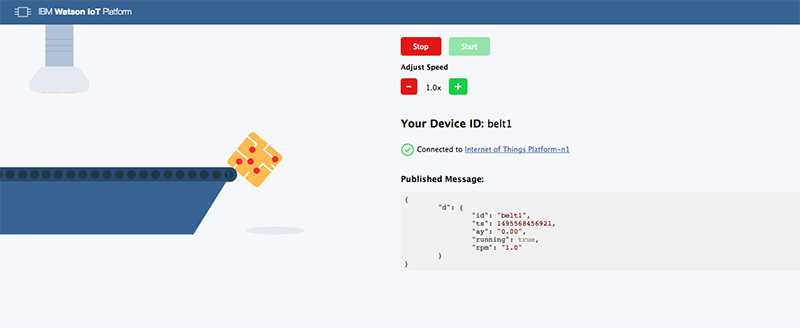

# conveyor-belt

A web app that simulates a conveyor belt that sends speed data to IBM Watson IoT Platform.

## Run your own copy of the web application

### Deploy through Bluemix devOps

 (via Continuous Delivery)

# Privacy notice

This web application includes code to track deployments to [IBM Bluemix](https://www.bluemix.net/) and other Cloud Foundry platforms. The following information is sent to a [Deployment Tracker](https://github.com/cloudant-labs/deployment-tracker) service on each deployment:

* Application Name (`application_name`)
* Space ID (`space_id`)
* Application Version (`application_version`)
* Application URIs (`application_uris)``

This data is collected from the `VCAP_APPLICATION` environment variable in IBM Bluemix and other Cloud Foundry platforms. This data is used by IBM to track metrics around deployments of sample applications to IBM Bluemix to measure the usefulness of our examples, so that we can continuously improve the content we offer to you. Only deployments of sample applications that include code to ping the Deployment Tracker service will be tracked.

## Disabling deployment tracking

Deployment tracking can be disabled by removing the require("cf-deployment-tracker-client").track(); line from the './www/bin' file.

## Useful links
[Install Node.js]: https://nodejs.org/en/download/
[bluemix_dashboard_url]: https://console.ng.bluemix.net/dashboard/
[bluemix_signup_url]: https://console.ng.bluemix.net/registration/
[cloud_foundry_url]: https://github.com/cloudfoundry/cli

[IBM Bluemix](https://bluemix.net/)  
[IBM Bluemix Documentation](https://www.ng.bluemix.net/docs/)  
[IBM Bluemix Developers Community](http://developer.ibm.com/bluemix)  
[IBM Watson Internet of Things](http://www.ibm.com/internet-of-things/)  
[IBM Watson IoT Platform](http://www.ibm.com/internet-of-things/iot-solutions/watson-iot-platform/)   
[IBM Watson IoT Platform Developers Community](https://developer.ibm.com/iotplatform/)
